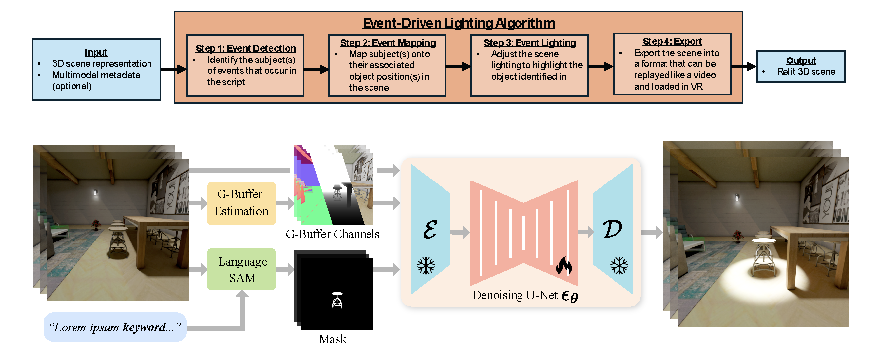

# AAAI-26 submission 2539: Event-Driven Lighting for Immersive Attention Guidance with Video Diffusion Model

<p align='center'>
<a href='https://quantum-whisper.github.io/'>Project Website</a> | <a href='https://anonymous.4open.science/r/EDL_SVD-2539/'>Data</a> | <a href='https://anonymous.4open.science/r/EDL_SVD-2539'>Code</a> | <a href='src/Relighting_Project_AAAI26_final.pdf'>Paper</a>
</p>

<p align="center">
   
</p>

This README provides comprehensive instructions for reproducing the training and evaluation results for our AAAI-26 submission.

<video src="src/EDL_suppl_video_2_compress.mp4" controls width="640" height="360">
   Your browser does not support the video tag.
</video>

## Prerequisites

- CUDA-enabled GPUs (minimum 4xA6000 GPUs  recommended for training, 1xA5000 GPUs for inference)
- CUDA toolkit >= 11.6
- Python >= 3.8
- conda or miniconda
- Git LFS (for large model files)

## Installation

### 1. Clone the Repository

Download this github repo from https://anonymous.4open.science/r/EDL_SVD-2539/


### 2. Setup Environment
```bash
conda env create -f environment.yml
conda activate DiffLight
```

## Data Preparation

### Download Pretrained Models and Data

1. **Pretrained Models**: Download from Google Drive link [PLACEHOLDER_LINK]
   - Extract to appropriate model directories as specified in training commands

2. **Preprocessed Data**: 
   - Currently available at: `/YOUR_DIR/svd_relight/sketchfab/rendering_pp`
   - For reproduction, download from [PLACEHOLDER_LINK]

### Data Structure
The preprocessed data should follow this structure:
```
data/
├── train/
│   ├── scene1/
│   │   ├── RGB0000.png
│   │   ├── albedo0000.png
│   │   ├── normal0000.png
│   │   ├── depth0000.png
│   │   ├── mask0000.png
│   │   └── relight0000.png
│   └── ...
└── test/
    └── [similar structure]
```

## Model Training

### Multi-GPU Training Command

Use the following command to train the model on 8 GPUs:

```bash
CUDA_VISIBLE_DEVICES=0,1,2,3 accelerate launch --multi_gpu train_svd_relight_syn.py \
  --pretrained_model_name_or_path="stabilityai/stable-video-diffusion-img2vid" \
  --mixed_precision='fp16' \
  --enable_xformers_memory_efficient_attention \
  --video_folder="/workspace/Data_img" \
  --report_to="wandb" \
  --learning_rate=1e-4 \
  --lr_scheduler="cosine_with_restarts" \
  --per_gpu_batch_size=2 \
  --gradient_accumulation_steps=8 \
  --num_train_epochs=5000 \
  --output_dir="/workspace/model_512/" \
  --num_workers=16 \
  --num_n_frames=14 \
  --num_frames=14 \
  --validation_steps=100 \
  --checkpointing_steps=500 \
  --width=512 \
  --height=512
```

### Training Configuration

- **Model**: Stable Video Diffusion (SVD) fine-tuned for relighting
- **Input Resolution**: 512×512
- **Batch Size**: 2 per GPU × 8 GPUs × 8 gradient accumulation = effective batch size of 128
- **Learning Rate**: 1e-4 with cosine restarts scheduler
- **Training Duration**: 5000 epochs
- **Mixed Precision**: FP16 for memory efficiency

### Monitoring Training

- Training progress is logged to Weights & Biases (wandb)
- Checkpoints are saved every 500 steps
- Validation runs every 100 steps

## Evaluation

We provide three evaluation scripts for different model comparisons:

### 1. EDL (Our Method) Evaluation
```bash
cd ~/EDL_SVD
python evaluate_edl.py
```

### 2. IC-Light Baseline Evaluation
```bash
cd ~/EDL_SVD
python evaluate_iclight.py
```

### 3. ScribbleLight Baseline Evaluation
```bash
cd ~/EDL_SVD
python evaluate_scribble.py
```

### Evaluation Metrics

The evaluation scripts compute the following metrics:
- **PSNR** (Peak Signal-to-Noise Ratio)
- **SSIM** (Structural Similarity Index)
- **LPIPS** (Learned Perceptual Image Patch Similarity)
- **MSE** (Mean Squared Error)

Results are saved as JSON files and logged to `metrics.log`.

## Single Image Inference

For single image inference, we provide three different methods:

### 1. EDL (Our Method)
```bash
CUDA_VISIBLE_DEVICES=0,1,2,3 python batch_inference.py \
  --pretrained_model_name_or_path "stabilityai/stable-video-diffusion-img2vid" \
  --pretrain_unet "/YOUR_DIR/svd_relight/paper_model_fin/checkpoint-6000/" \
  --video_folder "/YOUR_DIR/svd_relight/paper_fin" \
  --inferencemode train \
  --output_dir "/YOUR_DIR/svd_relight/sketchfab/rendering_pp" \
  --num_frames 14 \
  --per_gpu_batch_size 1 \
  --width 128 \
  --height 128
```

### 2. IC-Light Baseline
Navigate to the IC-Light directory and run:
```bash
cd ~/EDL_SVD/ic-light-tost
python single_inference.py \
  --rgb "~/ic-light-tost/colors_000.png" \
  --mask "~/ic-light-tost/mask_000.png" \
  --output "~/ic-light-tost/output_000.png"
```

### 3. ScribbleLight Baseline
Navigate to the ScribbleLight directory and run:
```bash
cd ~/EDL_SVD/scriblit
CUDA_VISIBLE_DEVICES=0 python inference_sketch.py \
  -n scribblelight_controlnet \
  -data paper_bike \
  -seed 1234
```

## Expected Results

### Quantitative Results

After running the evaluation scripts, you should expect the following approximate results:

| Method                | RMSE ↓         | PSNR ↑         | SSIM ↑         | LPIPS ↓        |
|-----------------------|----------------|----------------|----------------|----------------|
| ScribbleLight         | 0.3000 (0.172) | 10.612 (15.281)| 0.323 (0.487)  | 0.584 (0.483)  |
| IC-Light v1           | 0.367 (0.259)  | 8.781 (11.723) | 0.202 (0.370)  | 0.769 (0.615)  |
| EDL (Ours, 128×128)   | 0.061 (0.031)  | 24.528 (30.118)| 0.823 (0.916)  | 0.120 (0.046)  |
| EDL (Ours, 512×512)   | **0.042 (0.019)** | **28.423 (34.322)** | **0.904 (0.948)** | **0.070 (0.034)** |

*Numbers in parentheses indicate best-case results. Lower RMSE and LPIPS, higher PSNR and SSIM indicate better performance.*

*Note: Please refer to the paper for exact numerical values.*

### Qualitative Results
- Output images will be saved in the specified output directories
- Visual comparisons can be found in the `inference/` subdirectories


## Hardware Requirements

### Training
- **Minimum**: 4 × RTX A6000

### Inference
- **Minimum**: 1 × RTX A5000 

## Citation

If you use this code for your research, please cite:

```bibtex
@inproceedings{anonymous2026edl,
  title={[Paper Title]},
  author={[Anonymous for Review]},
  booktitle={Proceedings of the AAAI Conference on Artificial Intelligence},
  year={2026}
}
```
